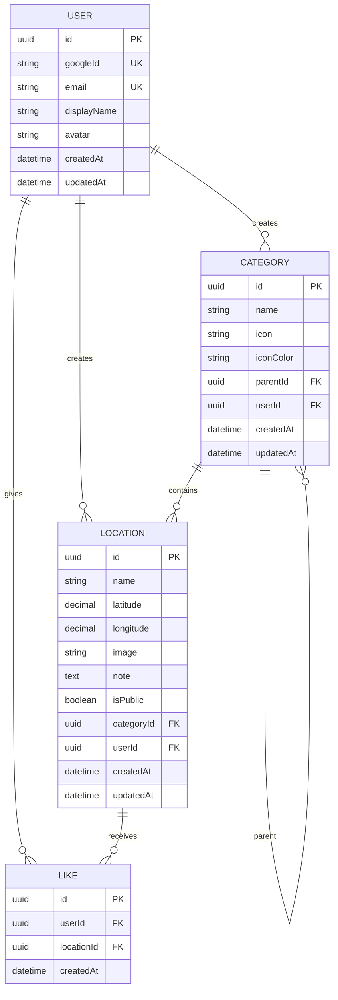

# 📍 iCheck - Implementation Plan
## Feature-by-Feature Vertical Slices (Option C)

> "Google Maps là bản đồ của mọi người, còn đây là bản đồ của riêng bạn."

---

## Tổng quan

Triển khai **iCheck** - ứng dụng web lưu trữ địa điểm cá nhân với GPS, ảnh, ghi chú và phân loại. Sử dụng chiến lược **Vertical Slices**: build từng feature từ Database → Backend → Frontend hoàn chỉnh trước khi chuyển sang feature tiếp theo.

| Layer | Technology |
|-------|------------|
| **Backend** | NestJS 11 + TypeORM + PostgreSQL |
| **Frontend** | Next.js 16 + Tailwind CSS 4 |
| **Auth** | Passport.js + Google OAuth 2.0 + JWT |
| **Map** | Leaflet + OpenStreetMap |
| **State** | Zustand |
| **Language** | Tiếng Việt |

---

## User Review Required

> [!IMPORTANT]
> **Prerequisites cần xác nhận:**
> 1. PostgreSQL localhost đang chạy? Database name?
> 2. Google Cloud Console đã có OAuth credentials (Client ID, Client Secret)?
> 3. Port backend (mặc định: 3001) và frontend (mặc định: 3000)?

> [!WARNING]
> Đây là **rebuild từ đầu** - sẽ thay đổi nhiều files. Scaffold hiện tại sẽ được mở rộng đáng kể.

---

## Database Schema



---

## Implementation Phases (Vertical Slices)

### 🔑 Phase 1: Authentication (Google OAuth + JWT)

> **Goal**: Người dùng đăng nhập bằng Google, nhận JWT token để truy cập API.

#### Backend Tasks
| # | Task | Files |
|---|------|-------|
| 1.1 | Cài dependencies (TypeORM, Passport, JWT, ConfigModule) | `package.json` |
| 1.2 | Tạo `.env` với DB connection, Google OAuth, JWT secret | `.env` |
| 1.3 | Thiết lập ConfigModule và TypeORM connection | `src/app.module.ts`, `src/config/` |
| 1.4 | Tạo User entity | `src/users/entities/user.entity.ts` |
| 1.5 | Tạo UsersModule (service, controller) | `src/users/` |
| 1.6 | Tạo AuthModule với Google Strategy | `src/auth/strategies/google.strategy.ts` |
| 1.7 | Tạo JWT Strategy và Guards | `src/auth/strategies/jwt.strategy.ts`, `src/common/guards/` |
| 1.8 | Tạo Auth Controller (login, callback, profile, logout) | `src/auth/auth.controller.ts` |

#### Frontend Tasks
| # | Task | Files |
|---|------|-------|
| 1.9 | Cài dependencies (Axios, Zustand, lucide-react) | `package.json` |
| 1.10 | Tạo types (User) | `types/user.ts` |
| 1.11 | Tạo API client và auth service | `lib/api/client.ts`, `lib/api/auth.ts` |
| 1.12 | Tạo Auth Zustand store | `lib/stores/auth.store.ts` |
| 1.13 | Tạo Login page với Google button | `app/login/page.tsx` |
| 1.14 | Tạo Auth callback handler | `app/auth/callback/page.tsx` |
| 1.15 | Tạo Navbar với user avatar | `components/layout/Navbar.tsx` |
| 1.16 | Cập nhật layout với AuthProvider | `app/layout.tsx` |

#### Verification (Phase 1)
- [ ] Build backend: `cd backend && npm run build`
- [ ] Build frontend: `cd frontend && npm run build`
- [ ] Manual: Mở browser → Login với Google → Redirect về home → Thấy avatar trên Navbar

---

### 📂 Phase 2: Categories CRUD

> **Goal**: Tạo, sửa, xóa danh mục (cha-con) với icon và màu sắc.

#### Backend Tasks
| # | Task | Files |
|---|------|-------|
| 2.1 | Tạo Category entity với parent-child relation | `src/categories/entities/category.entity.ts` |
| 2.2 | Tạo DTOs (create, update) | `src/categories/dto/` |
| 2.3 | Tạo CategoriesService với tree query | `src/categories/categories.service.ts` |
| 2.4 | Tạo CategoriesController (CRUD) | `src/categories/categories.controller.ts` |
| 2.5 | Import module vào AppModule | `src/app.module.ts` |

#### Frontend Tasks
| # | Task | Files |
|---|------|-------|
| 2.6 | Tạo types (Category) | `types/category.ts` |
| 2.7 | Tạo categories API service | `lib/api/categories.ts` |
| 2.8 | Tạo useCategories hook | `hooks/useCategories.ts` |
| 2.9 | Tạo UI components (IconPicker, ColorPicker) | `components/ui/` |
| 2.10 | Tạo Category form component | `components/category/CategoryForm.tsx` |
| 2.11 | Tạo Categories list page | `app/categories/page.tsx` |
| 2.12 | Tạo Create category page | `app/categories/new/page.tsx` |
| 2.13 | Tạo Edit category page | `app/categories/[id]/edit/page.tsx` |

#### Verification (Phase 2)
- [ ] Build backend: `cd backend && npm run build`
- [ ] Build frontend: `cd frontend && npm run build`
- [ ] Manual: Tạo category cha → Tạo category con → Edit → Delete → Verify tree structure

---

### 📍 Phase 3: Locations CRUD + GPS + Upload

> **Goal**: Check-in địa điểm với GPS tự động, upload ảnh, ghi chú, phân loại.

#### Backend Tasks
| # | Task | Files |
|---|------|-------|
| 3.1 | Tạo Location entity | `src/locations/entities/location.entity.ts` |
| 3.2 | Tạo DTOs (create, update, filter) | `src/locations/dto/` |
| 3.3 | Thiết lập Multer upload | `src/locations/locations.module.ts` |
| 3.4 | Tạo LocationsService (CRUD, filter, search) | `src/locations/locations.service.ts` |
| 3.5 | Tạo LocationsController | `src/locations/locations.controller.ts` |
| 3.6 | Serve static files cho uploads | `src/app.module.ts` |

#### Frontend Tasks
| # | Task | Files |
|---|------|-------|
| 3.7 | Tạo types (Location) | `types/location.ts` |
| 3.8 | Tạo locations API service | `lib/api/locations.ts` |
| 3.9 | Tạo useLocations hook với pagination | `hooks/useLocations.ts` |
| 3.10 | Tạo useGeolocation hook | `hooks/useGeolocation.ts` |
| 3.11 | Tạo LocationCard component | `components/location/LocationCard.tsx` |
| 3.12 | Tạo LocationForm component | `components/location/LocationForm.tsx` |
| 3.13 | Tạo Create location page | `app/locations/new/page.tsx` |
| 3.14 | Tạo Locations list page | `app/locations/page.tsx` |
| 3.15 | Tạo Location detail page | `app/locations/[id]/page.tsx` |
| 3.16 | Tạo Edit location page | `app/locations/[id]/edit/page.tsx` |
| 3.17 | Thêm nút "Mở Google Maps" | Location detail page |

#### Verification (Phase 3)
- [ ] Build backend: `cd backend && npm run build`
- [ ] Build frontend: `cd frontend && npm run build`
- [ ] Manual: Tạo location → GPS tự động lấy → Upload ảnh → Chọn category → View detail → Mở Google Maps

---

### 🗺️ Phase 4: Map Dashboard

> **Goal**: Hiển thị tất cả địa điểm trên bản đồ Leaflet với markers và popups.

#### Frontend Tasks
| # | Task | Files |
|---|------|-------|
| 4.1 | Cài Leaflet dependencies | `package.json` |
| 4.2 | Tạo Map component (dynamic import) | `components/map/Map.tsx` |
| 4.3 | Tạo LocationMarker component | `components/map/LocationMarker.tsx` |
| 4.4 | Tạo LocationPopup component | `components/map/LocationPopup.tsx` |
| 4.5 | Tạo FAB check-in button | `components/layout/FAB.tsx` |
| 4.6 | Cập nhật Home page với Map Dashboard | `app/page.tsx` |
| 4.7 | Thêm search bar và filter chips | Home page |
| 4.8 | Thêm nút current location | Map component |

#### Verification (Phase 4)
- [ ] Build frontend: `cd frontend && npm run build`
- [ ] Manual: Mở home → Thấy bản đồ full-screen → Markers hiển thị → Click marker → Popup hiện → FAB hoạt động

---

### ❤️ Phase 5: Likes + Profile Timeline

> **Goal**: Like/unlike địa điểm công khai, hiển thị timeline trên profile.

#### Backend Tasks
| # | Task | Files |
|---|------|-------|
| 5.1 | Tạo Like entity | `src/likes/entities/like.entity.ts` |
| 5.2 | Tạo LikesService | `src/likes/likes.service.ts` |
| 5.3 | Tạo LikesController (like/unlike) | `src/likes/likes.controller.ts` |
| 5.4 | Thêm public locations endpoint | `src/locations/locations.controller.ts` |
| 5.5 | Thêm user profile endpoint | `src/users/users.controller.ts` |

#### Frontend Tasks
| # | Task | Files |
|---|------|-------|
| 5.6 | Tạo likes API service | `lib/api/likes.ts` |
| 5.7 | Thêm Like button vào LocationCard | `components/location/LocationCard.tsx` |
| 5.8 | Thêm toggle Public/Private | Location list page |
| 5.9 | Tạo Profile page với timeline | `app/profile/page.tsx` |
| 5.10 | Tạo ProfileTimeline component | `components/profile/ProfileTimeline.tsx` |

#### Verification (Phase 5)
- [ ] Build backend: `cd backend && npm run build`
- [ ] Build frontend: `cd frontend && npm run build`
- [ ] Manual: Toggle location public → Xem profile → Thấy timeline → Like location → Count tăng

---

### 🎨 Phase 6: Polish & UI/UX

> **Goal**: Loading states, toast notifications, mobile optimization.

#### Frontend Tasks
| # | Task | Files |
|---|------|-------|
| 6.1 | Tạo Spinner component | `components/ui/Spinner.tsx` |
| 6.2 | Tạo Toast component | `components/ui/Toast.tsx` |
| 6.3 | Thêm loading skeletons | All pages |
| 6.4 | Responsive testing và fixes | All components |
| 6.5 | Cập nhật global styles (Be Vietnam Pro font) | `app/globals.css` |

#### Verification (Phase 6)
- [ ] Build frontend: `cd frontend && npm run build`
- [ ] Manual: Test trên mobile viewport → Loading hiển thị → Toast notifications hoạt động

---

## API Endpoints Summary

### Authentication
| Method | Endpoint | Description |
|--------|----------|-------------|
| GET | `/auth/google` | Initiate Google OAuth |
| GET | `/auth/google/callback` | OAuth callback |
| GET | `/auth/profile` | Get current user |
| POST | `/auth/logout` | Logout |

### Categories
| Method | Endpoint | Description |
|--------|----------|-------------|
| GET | `/categories` | List all categories (tree) |
| GET | `/categories/:id` | Get category by ID |
| POST | `/categories` | Create category |
| PATCH | `/categories/:id` | Update category |
| DELETE | `/categories/:id` | Delete category |

### Locations
| Method | Endpoint | Description |
|--------|----------|-------------|
| GET | `/locations` | List locations with filters |
| GET | `/locations/:id` | Get location by ID |
| POST | `/locations` | Create location (multipart/form-data) |
| PATCH | `/locations/:id` | Update location |
| DELETE | `/locations/:id` | Delete location |
| GET | `/locations/public` | Public locations for timeline |

### Likes
| Method | Endpoint | Description |
|--------|----------|-------------|
| POST | `/locations/:id/like` | Like location |
| DELETE | `/locations/:id/like` | Unlike location |

---

## Verification Plan

### Automated (Build Checks)
```powershell
# Backend build
cd backend && npm run build

# Frontend build  
cd frontend && npm run build
```

### Manual Testing Checklist
| Phase | Test Steps |
|-------|------------|
| 1 | Login Google → Thấy avatar → Logout → Redirect về login |
| 2 | Tạo category cha → Tạo category con → Edit icon/color → Delete |
| 3 | Tạo location + GPS + ảnh → View list → Detail → Edit → Google Maps |
| 4 | Map hiển thị markers → Click marker → Popup → FAB → Filter |
| 5 | Toggle public → Profile timeline → Like/unlike → Count cập nhật |
| 6 | Mobile viewport → Loading states → Toast notifications |

---

## Estimated Timeline

| Phase | Duration | Cumulative |
|-------|----------|------------|
| Phase 1: Auth | ~1h | 1h |
| Phase 2: Categories | ~45m | 1h 45m |
| Phase 3: Locations | ~1.5h | 3h 15m |
| Phase 4: Map | ~1h | 4h 15m |
| Phase 5: Likes/Profile | ~45m | 5h |
| Phase 6: Polish | ~30m | 5h 30m |

---

## Next Steps

Sau khi review plan này:
1. Xác nhận prerequisites (PostgreSQL, Google OAuth credentials)
2. Chạy `/create` hoặc chỉ thị để bắt đầu Phase 1
